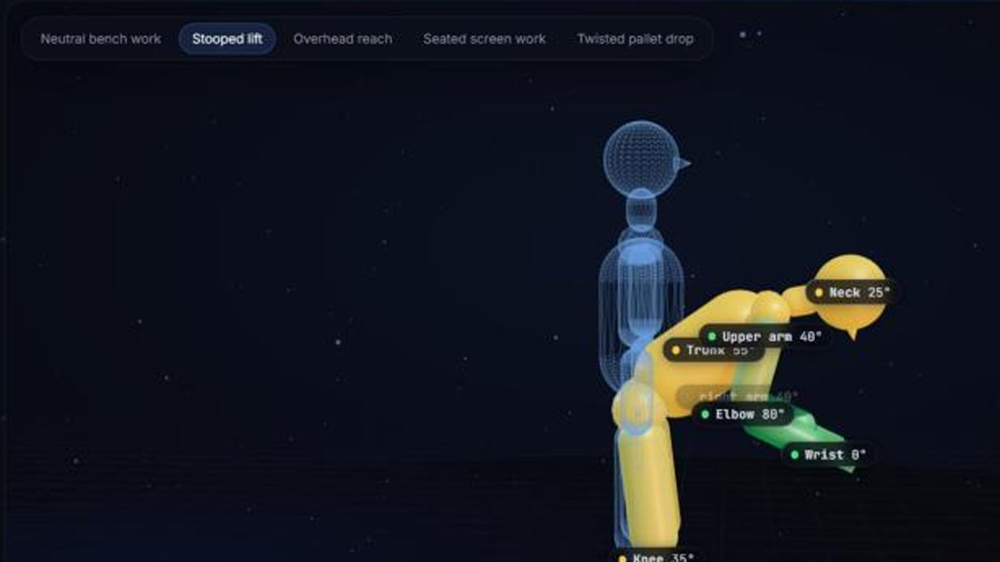
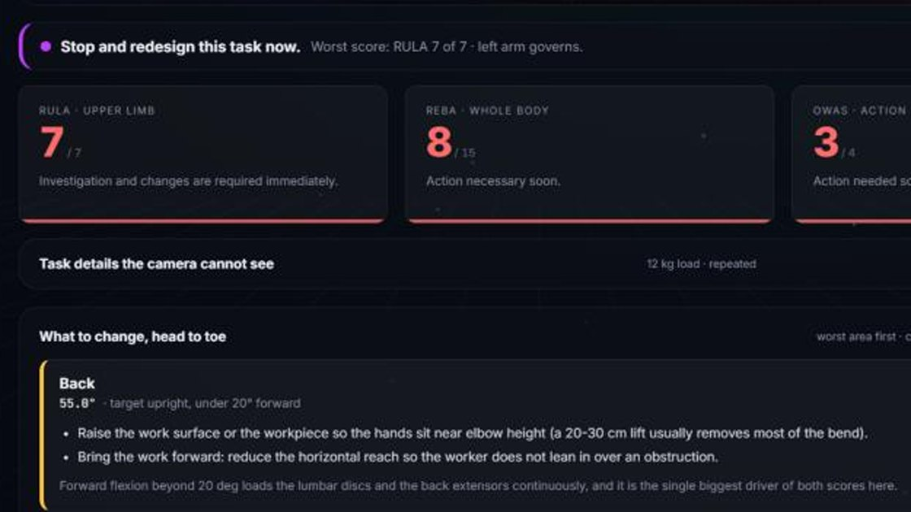
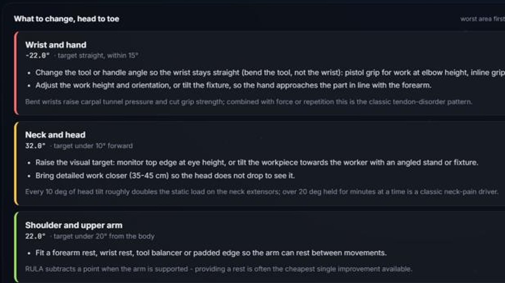
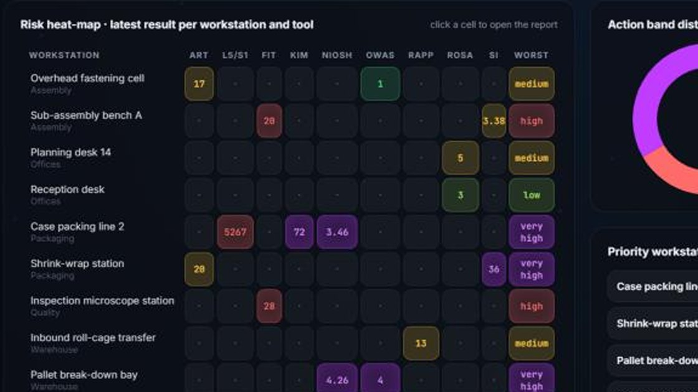
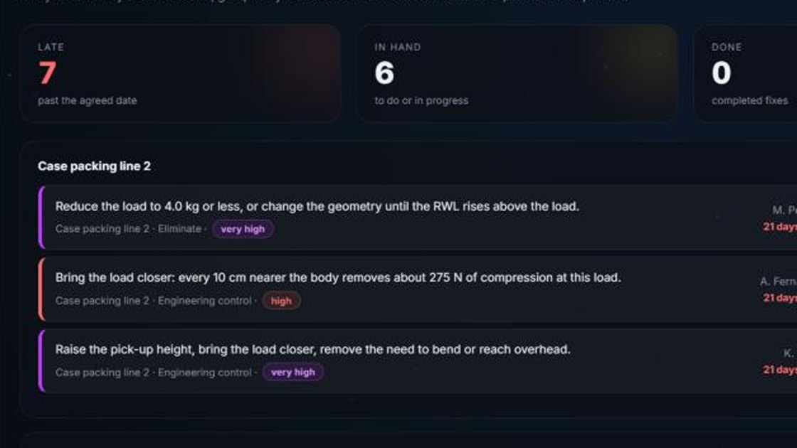

# ErgoVision

**See the risk before the injury.**

Upload a photo or a short video of a workstation. ErgoVision measures the
worker's joint angles, scores the job on the published ergonomics worksheets,
and tells you in plain language what to change — then keeps every workstation,
score and fix in one register.



---

## What it does

| | |
|---|---|
| **Measures** | MediaPipe finds 33 body points; the engine converts them into the angles the worksheets are actually defined on — each joint against its correct reference line |
| **Scores** | RULA, REBA and OWAS from the photo; nine more methods from what you observe on the floor |
| **Explains** | every score comes with its row-by-row arithmetic, so you can check it against a printed worksheet |
| **Prioritises** | one shared 0–4 action band across all eleven methods, so a lifting index and a chair score rank in the same register |
| **Tracks** | fixes with an owner and a due date, and a dashboard showing which station needs attention first |

### The eleven methods

| Posture | Manual handling | Repetition | Office | Engineering |
|---|---|---|---|---|
| RULA · REBA · OWAS | NIOSH lifting equation · KIM-LHC · RAPP | Strain Index · HSE ART | ROSA | L5/S1 load model · Workstation fit |

Thresholds, sources and the band mapping for every one: **[docs/TOOLS.md](docs/TOOLS.md)**.

---

## Run it

```bash
pip install -r requirements.txt
python download_model.py        # one-off: fetches the 9 MB pose model
python app.py                   # then open http://127.0.0.1:5000/
```

```bash
python tests/test_scoring.py    # vision + RULA/REBA — 39 tests
python tests/test_tools.py      # the other nine methods — 34 tests
```

On first open the dashboard offers a demo plant: nine workstations and fifteen
assessments, every number produced by really running the engines. Clear it from
the dashboard when you start entering your own.

---

## The console

Scores with the worksheet arithmetic behind them, then the fixes head to toe —
worst area first, in words a supervisor can act on:





Every workstation against every method, so the worst job on the floor is
obvious at a glance:



And the follow-up, with a name and a date on each item:



---

## Deploy it

The app is Python with MediaPipe, so GitHub Pages cannot host it — it needs a
container host. A `Dockerfile` and a Render blueprint are included.

**Render** — one click, then sign in and confirm:

[](https://render.com/deploy?repo=https://github.com/law-liet17/ErgoVision)

Or from the dashboard: New → Blueprint → point it at this repo. `render.yaml` does the rest.

**Anywhere else that takes Docker:**

```bash
docker build -t ergovision .
docker run -p 8000:8000 ergovision
```

The pose model is downloaded during the build, so the container never fetches it
at run time. On a free plan there is no persistent disk: the register resets on
each deploy, which is fine for a demo — uncomment the `disk:` block in
`render.yaml` on a paid plan to keep real records.

---

## How it is put together

```
web/                 the console (dashboard · register · actions · guided assessment)
  twin.js              the Three.js digital twin, posed by the measured angles
app.py               Flask API + static hosting
store.py             SQLite risk register: workstations, assessments, actions
main.py              live webcam viewer, same engine
ergonomics/
  angles.py            landmarks -> the angles the worksheets need  <- the hard part
  rula.py reba.py      the posture worksheets, transcribed as lookup tables
  pose_backend.py      works with either MediaPipe generation
  tools/               niosh · kim · rapp · strain_index · art · rosa · owas · biomech · fit
tests/               73 tests over the tables, the bands and the angle extraction
docs/                SCORING.md · TOOLS.md · FLOWCHART.md
promo/               the 35-second promo film and its voice-over
```

**[docs/SCORING.md](docs/SCORING.md)** is the one to read if you care how a pose
becomes a score: which reference line each joint is measured against, why `0°`
means different things on different worksheet rows, and why direction has to be
kept instead of taking the magnitude.

**[docs/FLOWCHART.md](docs/FLOWCHART.md)** is the seven-stage flow from a task to
a ranked fix list.

---

## Honest limits

* RULA and REBA are defined on **sagittal angles** — shoot from the worker's
  side. A front-on photo underestimates them, and the report says so.
* Single-camera depth is weak, so twist, side bending and abduction are
  **flags you confirm**, not trusted measurements.
* Load, repetition, duration, grip and arm support are **not visible in a
  photograph**. The app asks for them; it never guesses.
* The L5/S1 model is a two-segment static estimate for ranking and explanation,
  not a 3D dynamic simulation.
* Every method here is a **screening tool**: it says where to look and how
  urgently, not whether a particular worker will be injured.

Validation status is shown on every tool in the app — `verified` (checked by
unit tests against the published source), `transcribed` (confirm against the
printed worksheet before regulatory use) or `model` (an engineering estimate).

---

## Sources

McAtamney & Corlett (RULA, 1993) · Hignett & McAtamney (REBA, 2000) ·
Karhu, Kansi & Kuorinka (OWAS, 1977) · Waters, Putz-Anderson, Garg & Fine
(NIOSH, 1993) · Moore & Garg (Strain Index, 1995) · Sonne, Villalta & Andrews
(ROSA, 2012) · HSE INDG438 (ART) · HSE INDG478 (RAPP) · BAuA (KIM-LHC, 2001) ·
Chaffin-style static biomechanics with the NIOSH 1981 compression limits ·
Drillis & Contini anthropometric ratios.
